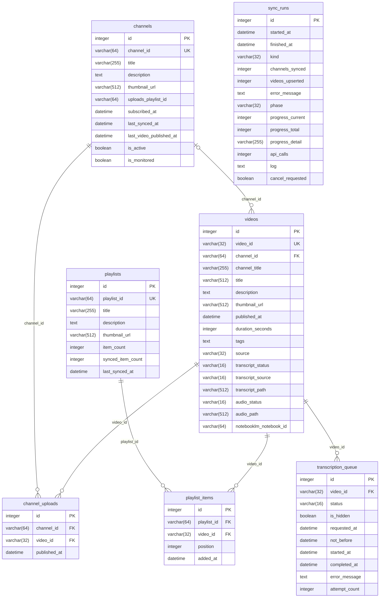

# ytfeed

Personal YouTube feed: sync subscriptions/playlists/recent uploads into a local
SQLite DB, browse/search/filter them in a local web UI, queue videos for
transcription, and pipe transcripts into an Obsidian RAG vault.

**Storage split**: the Obsidian vault gets markdown files with frontmatter,
the video description (recipes, links, and chapter notes often live there),
and the transcript. Descriptions are compiled from two sources: sync fills
them from the YouTube Data API, and yt-dlp covers whatever sync missed at
transcription time. Everything else — statuses, queue history, sync audit —
lives in the SQLite DB.

## Setup

```bash
python3 -m venv .venv
.venv/bin/pip install -e ".[desktop,dev]"
cp config.example.toml config.toml   # then edit paths
.venv/bin/python -m ytfeed init-db
```

Requirements outside this repo:
- A Google OAuth client secret JSON (`paths.client_secret_path`) with the
  YouTube Data API enabled — first sync opens a browser for one-time consent;
  the token is stored at `secrets/token.json`.
- An authenticated `notebooklm-py` profile in `~/.notebooklm/` (run
  `notebooklm login` once) for transcript tier 1.

## Usage

```bash
.venv/bin/python -m ytfeed sync            # subscriptions + playlists + uploads
.venv/bin/python -m ytfeed sync --full     # ignore early-stop, walk full history
.venv/bin/python -m ytfeed serve           # web UI at http://127.0.0.1:8000
.venv/bin/python -m ytfeed transcribe --limit 5
.venv/bin/python -m ytfeed describe --apply --fetch  # backfill ## Description sections
```

## Launching

`scripts/ytfeed-launch` starts the server if needed (never duplicates it) and
opens the browser. Wire it up once:

```bash
# global command — `ytfeed` from any directory
ln -sf "$(pwd)/scripts/ytfeed-launch" /opt/homebrew/bin/ytfeed   # macOS/Homebrew
# (Linux: link into ~/.local/bin and swap `open` for `xdg-open` in the script)

```

The server log lands in `data/server.log`. Port override: `YTFEED_PORT=8080 ytfeed`.

## Packaging

`packaging/` holds the other launch targets — macOS `/Applications/ytfeed.app` (native pywebview
window, compiled launcher; build with `packaging/desktop/macos/build.sh`), a Linux desktop entry,
and a Docker image — so `ytfeed/` never changes for one. The window attaches to a server already
on :8000 (e.g. one started by `ytfeed-launch`) or starts its own. See
[`packaging/README.md`](packaging/README.md). ytfeed is deliberately not in the `homelab` compose
file yet: its YouTube OAuth token, NotebookLM profile and SQLite file all live on the host.

## Web UI

- **Recents** — newest videos from ★-monitored channels; the channel picker
  overrides for one-off views; title search and transcript-status filters.
- **Subscriptions** — all subs with star toggles; channels open in a new tab
  with "Refresh recent" and "Load full history".
- **Playlists** — your playlists and their videos.
- **Queue** — every video list has checkboxes (shift-click selects a range,
  plus a select-all toggle) and "Queue selected for transcription".
  "Run transcription now" processes the queue in batches with live progress;
  "Clear queue" cancels pending items and hides history (rows stay in the DB).
- **Settings** — config summary, DB stats, manual "Sync now".

## Transcript pipeline (3 tiers)

1. **NotebookLM** (`notebooklm-py`) — videos batched 50 per throwaway
   `ytfeed-batch-*` notebook; transcripts extracted via source fulltext
   (verbatim caption track), then the notebook is deleted.
2. **youtube-transcript-api** — direct caption fetch, paced 1 req/s.
   IP rate-limits (`IpBlocked`/`RequestBlocked`) are treated as transient:
   nothing is written, the item is deferred 5 minutes and retried
   automatically by a background monitor thread (up to 5 attempts). After
   3 consecutive blocks the rest of the batch defers immediately.
3. **Placeholder** — `*(PLACEHOLDER).md` stub for videos with no captions;
   re-queuing a placeholder/failed video re-enters the pipeline, and a later
   success replaces the stub. Videos already `done` are never re-queued.

## Vault file layout

Each transcript file is flat in `raw/` with frontmatter, the description, and
the transcript:

```
---
video_id: QZWxpB8zGQM
channel: "Cowboy Kent Rollins"
published: 2026-04-01T19:30:03Z
url: https://www.youtube.com/watch?v=QZWxpB8zGQM
source: notebooklm
category: "Cooking"
tags: []
---

# <title>

## Description

<video description — recipes, links, chapter notes>

## Transcript

<transcript>
```

`category` is the video's playlist, derived at write time
(`transcripts/categorize.py`): the most recently added playlist membership
wins (ties and missing timestamps fall back to the smallest playlist;
same-named playlists merge). Videos in no playlist get no `category` line.
The `## Description` section is omitted when the video has no description.

## Schema

Generated from `ytfeed/db/models.py` — refresh with `scripts/update-erd`.

<!-- ERD:START (generated by scripts/update-erd — do not edit by hand) -->

<!-- ERD:END -->

## Engineering notes

- SQLite runs in WAL mode with a 30s busy timeout; sync keeps all network
  I/O outside write transactions so the web app stays responsive mid-sync.
- Sync early-stops per channel once it hits known videos (~1 quota
  unit/channel steady-state); first sync backfills `sync.initial_backfill`
  videos (default 50), full history on demand.
- One pipeline run at a time (process-wide lock); interrupted runs are
  recovered on server startup.

## Tests

```bash
.venv/bin/python -m unittest discover tests
```
